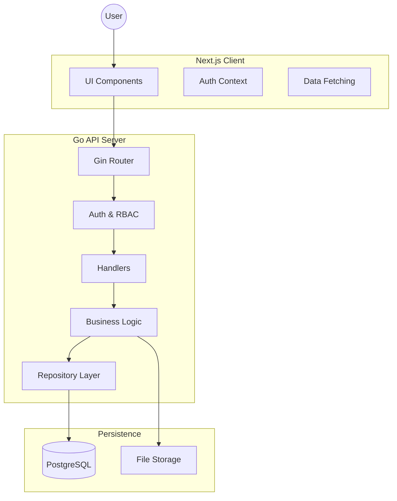
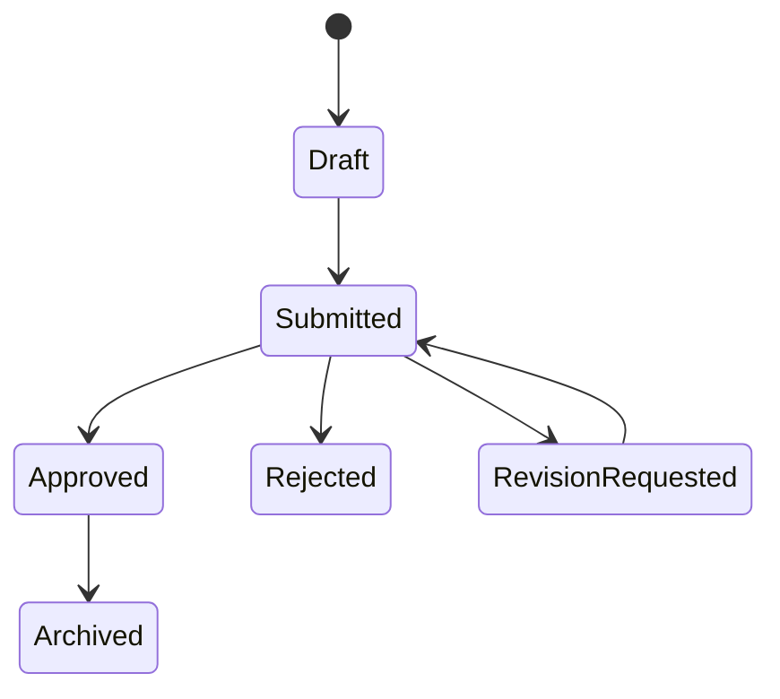

<div align="center">


# 🎓 University Project Hub

**The All‑in‑One Platform for Managing Academic Capstone Lifecycles**

[](https://nextjs.org/)
[](https://go.dev/)
[](https://www.postgresql.org/)
[](./LICENSE)

<p align="center">
  <a href="#-overview">Overview</a> •
  <a href="#-features">Features</a> •
  <a href="#-tech-stack">Tech Stack</a> •
  <a href="#-system-architecture">Architecture</a> •
  <a href="#-getting-started">Getting Started</a> •
  <a href="#-api-documentation">API Docs</a>
</p>
</div>

---

## 📸 Dashboard Preview

<div align="center">
  
</div>

> 📌 **Note:** Replace images inside `docs/images/` with real screenshots (Login, Dashboard, Proposal View) before final submission.

---

## 🚀 Overview

**University Project Hub** is a centralized digital platform designed to manage the entire **Graduation Capstone (GC)** lifecycle within universities. It eliminates fragmented communication and manual workflows by providing a single, transparent system for students, advisors, and administrators.

### 🚩 The Problem

* ❌ Fragmented communication via emails and paperwork
* ❌ No proposal version control or approval traceability
* ❌ Students lack visibility into proposal status
* ❌ Advisors overloaded with unstructured reviews

### ✅ The Solution

A role‑based web platform where:

* **Students** form teams and submit proposals
* **Advisors** review, comment, approve, or request revisions
* **Admins** manage users, departments, deadlines, and oversight

---

## 🌟 Features

| 🎓 Students                  | 👩‍🏫 Advisors                     | 🏛️ Admins                     |
| ---------------------------- | ---------------------------------- | ------------------------------ |
| Team formation & invitations | Centralized review dashboard       | User & role management         |
| Version‑controlled proposals | Approve / Reject / Revise workflow | Advisor assignment             |
| Real‑time status tracking    | Historical version access          | Academic year configuration    |
| Peer discovery by department | Supervision workload view          | Audit logs & system monitoring |

---

## 🛠️ Tech Stack

### Frontend

* **Framework:** Next.js 14 (App Router)
* **Language:** TypeScript
* **Styling:** Tailwind CSS + shadcn/ui
* **State & Data:** React Context + SWR
* **Notifications:** React Hot Toast

### Backend

* **Language:** Go (Golang 1.23)
* **Framework:** Gin
* **Database:** PostgreSQL
* **ORM:** GORM
* **Authentication:** JWT + RBAC
* **Documentation:** Swagger (Swaggo)

---

## 🏗️ System Architecture

### High‑Level Architecture



### Proposal State Machine



---

## ⚡ Getting Started

### Prerequisites

* Node.js **18+**
* Go **1.22+**
* PostgreSQL **14+**

---

### 1️⃣ Backend Setup

```bash
# Clone backend repository
git clone https://github.com/YourOrg/university-project-hub-backend.git
cd university-project-hub-backend

# Environment variables
cp .env.example .env

# Install dependencies
go mod tidy

# Run server (auto‑migrates database)
go run cmd/server/main.go
```

---

### 2️⃣ Frontend Setup

```bash
# Clone frontend repository
git clone https://github.com/YourOrg/university-project-hub-frontend.git

# Install dependencies
npm install

# Environment configuration
echo "NEXT_PUBLIC_API_URL=http://localhost:8080/api/v1" > .env.local

# Run development server
npm run dev
```

---

### 3️⃣ Access the Application

| Service        | URL                                                                                  |
| -------------- | ------------------------------------------------------------------------------------ |
| Frontend       | [http://localhost:3000](http://localhost:3000)                                       |
| Backend Health | [http://localhost:8080/health](http://localhost:8080/health)                         |
| API Docs       | [http://localhost:8080/swagger/index.html](http://localhost:8080/swagger/index.html) |

---

## 📂 Project Structure

```text
root/
├── cmd/                # Application entry points
├── internal/
│   ├── auth/           # Authentication & RBAC
│   ├── domain/         # Entities & interfaces
│   ├── teams/          # Team management
│   ├── proposals/      # Proposal workflows
│   └── users/          # User management
├── pkg/
│   ├── database/       # DB connection & seeding
│   └── utils/          # Shared helpers
└── docs/               # Swagger & diagrams
```

---

## 🔌 API Documentation

Interactive API documentation is generated using **Swagger**.

Once the backend is running, visit:

```
http://localhost:8080/swagger/index.html
```

---

## 👥 Authors & Contributors

* **Jaefer** — Team Lead & Backend Architect
* **Nebiyu** — Backend Core & Security
* **Kalkidan** — Advisor Workflow
* **John** — Documentation & File Management
* **Frontend Team** — UI/UX Implementation

---

## 📜 License

This project is licensed under the **MIT License**.
See the [LICENSE](./LICENSE) file for details.

---

<div align="center">
<sub>Built with ❤️ by the Capstone Team at ASTU</sub>
</div>
